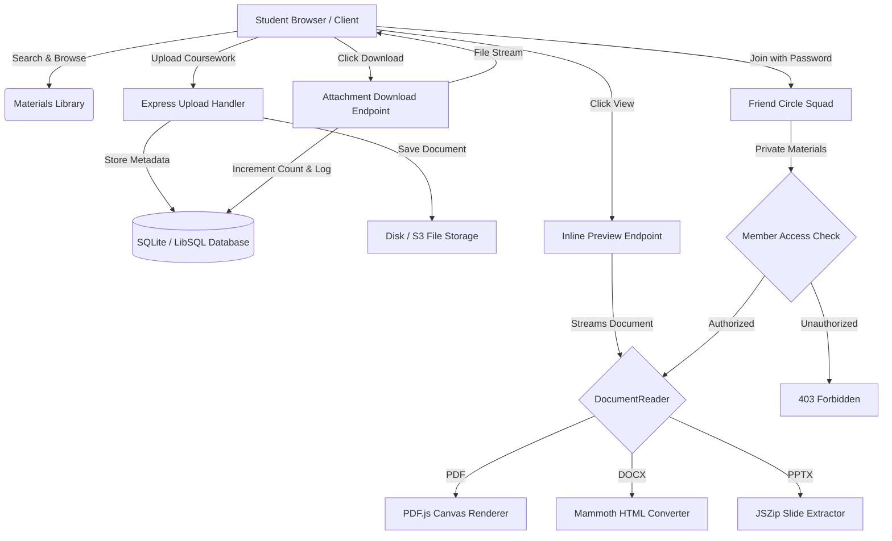

# StudentShare

> **Find. Share. Learn.**

StudentShare is a centralized, full-stack academic material sharing platform designed for university students, educators, and peer study communities. It eliminates scattered chat-group attachments, broken cloud drive links, and unverified coursework notes by providing a single, structured digital library with in-browser multi-format document previewing, private collaborative study circles, and peer-reviewed academic content.

---

## 1. Project Overview

At universities and colleges, students constantly produce and seek high-quality academic resources: lecture notes, handwritten summaries, past university question papers, lab manuals, and seminar presentations. However, these assets are typically shared through ephemeral group chats, personal cloud folders, or email threads—resulting in poor searchability, duplicate uploads, missing file dependencies, and zero peer accountability.

**StudentShare** solves this challenge by establishing an organized, repository-driven academic hub. It structures materials by academic department, semester, subject, unit, and curriculum topic while providing real-time in-browser document reading (PDF, DOCX, PPTX), personal bookmarking, download tracking, moderation workflows, and private password-protected Friend Circles for focused peer study squads.

---

## 2. Problem Statement

Modern university coursework faces several recurring collaboration bottlenecks:

1. **Fragmented Distribution Channels**: Study resources are scattered across WhatsApp, Telegram, Discord, and personal Google Drive folders, making older materials difficult for junior batches to locate.
2. **Forced File Downloads for Quick Inspection**: Traditional systems force students to download multi-megabyte PDFs, Word docs, or slide presentations locally just to verify whether the content matches their syllabus.
3. **Lack of Quality Assurance & Peer Verification**: Unvetted files frequently circulate with inaccurate formulas or outdated syllabi, with no mechanism for student ratings, reviews, or academic reporting.
4. **Privacy vs. Public Sharing Trade-offs**: Students lack a secure mechanism to share private assignment drafts, group project slide decks, or confidential mock tests exclusively with trusted circle members.
5. **No Centralized Governance**: Institutions lack administrative visibility into flagged, duplicate, or copyright-infringing uploads.

---

## 3. Proposed Solution

StudentShare addresses these challenges with a cohesive full-stack web architecture:

- **Centralized Coursework Taxonomy**: Materials are indexed with standardized metadata—Academic Department, Degree Year, Semester, Subject, Unit Number, Topic, and Document Category.
- **In-App Document Reader Engine**: Real multi-format viewer powered by `pdfjs-dist`, `mammoth`, and `jszip`. Students can view multi-page PDFs, Microsoft Word documents, and slide decks directly inside the browser before choosing to download.
- **Decoupled View vs. Download Actions**: Previewing a document streams inline bytes without inflating download statistics or consuming device storage, while explicit downloads are tracked for popularity rankings.
- **Private Friend Circles**: Students can establish invite-only circles with cryptographic password protection, enabling private peer study sessions, member-only announcements, and circle-restricted document sharing.
- **Role-Based Governance**: Comprehensive administrative dashboards to approve materials, audit users, review reports, and manage academic categories.

---

## 4. Key Features

### 🔐 Google & Email Authentication
- Secure registration and login using industry-standard bcrypt password hashing and JSON Web Tokens (JWT).
- Modular OAuth provider detection that safely handles Google Sign-In with truthful status indicators when cloud client credentials are unconfigured.
- Automated session persistence and token refresh across page reloads.

### 📤 Upload Academic Materials
- Structured upload flow requiring curriculum metadata: title, subject, syllabus topic, academic department, semester, unit, and document category (Notes, Question Bank, Lab Manual, Cheat Sheet, Presentation).
- Server-side multi-part file processing with automated file type detection, size limits, and sanitization.

### 🔍 Search, Filter & Multi-Criteria Sorting
- Instant keyword search across material titles, topics, descriptions, and user tags.
- Dynamic faceted filters by Department, Year, Semester, Unit, Subject, and Material Type.
- Multi-dimensional sorting: Newest First, Most Downloaded, and Highest Rated.

### 📖 In-Browser PDF, DOCX & PPTX Preview
- **PDF Documents**: Rendered on high-DPI HTML5 canvas elements via `pdfjs-dist` with continuous page scrolling, page indicator (`Page X / Y`), and zoom controls (`[ − ] [ 100% ] [ + ]`).
- **DOCX Documents**: Rendered in-browser using `mammoth` to convert OpenXML document structures into clean, readable typography with headings, tables, and lists.
- **PPTX Presentations**: Slide decks are unpacked via `jszip` to extract slide titles, bullet points, and deck structure into interactive slide cards with step-by-step navigation.

### ⚖️ Separate View and Download Actions
- **View / Read**: Streams document bytes with `Content-Disposition: inline` and `Accept-Ranges: bytes`. Increments material view counts without inflating download metrics.
- **Download**: Explicit user action with `Content-Disposition: attachment`. Increments download metrics and logs the transaction to the user's permanent download history.

### 🔖 Bookmarks & Saved Materials
- One-click bookmarking system enabling students to curate personal study collections for upcoming midterms and finals.

### ⭐ Ratings & Content Reporting
- 5-star peer rating system with optional written reviews to highlight high-yield study materials.
- Academic moderation reporting mechanism allowing students to flag outdated syllabi, duplicate uploads, or inappropriate content for administrator review.

### 📜 Download History Tracking
- Transparent audit log of all files downloaded by the student, enabling quick re-access to previously studied materials.

### 👥 Private Friend Circles
- Collaborative study squads designed for semester teams, lab partners, or exam prep groups.
- Direct member-to-member announcements and private coursework sharing.

### 🛡️ Circle Password & Access Authorization
- Cryptographically hashed passwords for circle joining.
- Strict authorization middleware preventing non-members from previewing or downloading circle-restricted documents via direct API endpoints.

### 🔔 System & Activity Notifications
- Real-time notification feed tracking material publication, circle invitations, new announcements, and moderation updates.

### 🛠️ Dedicated Administrator Dashboard
- Protected dashboard for campus administrators and teaching assistants.
- Platform statistics: total materials, active students, downloads, and circles.
- Content moderation queue: approve, reject, unapprove, or delete materials.
- User management: role promotion (STUDENT to ADMIN) and account suspension controls.

### 🤖 AI-Ready Academic Assistance Architecture
- Architecture prepared for LLM integration (Google Gemini / OpenAI).
- Dedicated controller endpoints (`/api/materials/:id/ai-summary` and `/api/materials/:id/ai-ask`) structured to ingest document text and answer student queries when API keys are configured.

---

## 5. How StudentShare Works



1. **Upload & Indexing**: A student uploads a file along with syllabus tags. The server validates the payload, generates an isolated file path, and records metadata in the database.
2. **Library Discovery**: Students search by course code, filter by semester, or sort by rating.
3. **In-Browser Reading**: Clicking **View** opens the dedicated reader (`/materials/:id/view`). The backend verifies permissions (public vs. circle-restricted) and streams the file with inline headers.
4. **Explicit Downloading**: Students who need offline copies click **Download**, which logs download history and increments download statistics.

---

## 6. Technology Stack

| Layer | Technology | Purpose |
| :--- | :--- | :--- |
| **Frontend Framework** | React 18 | Declarative component hierarchy and reactive state management |
| **Build Tool** | Vite 6 | Ultra-fast Hot Module Replacement (HMR) and optimized asset bundling |
| **Language** | TypeScript 5 | Strict end-to-end type safety across client and server |
| **Styling** | Tailwind CSS 3 | Modern utility-first responsive design and custom academic palettes |
| **Icons** | Lucide React | Clean, accessible iconography |
| **Backend Runtime** | Node.js (v20+) | High-throughput asynchronous JavaScript runtime |
| **Web Server** | Express 4 | RESTful API routing, middleware chaining, and streaming endpoints |
| **Database** | SQLite / LibSQL | Embedded, zero-configuration SQL database with ACID guarantees |
| **ORM** | Drizzle ORM | Type-safe SQL schema definitions, migrations, and query execution |
| **Password Hashing** | bcryptjs | Cryptographic one-way password hashing (salt rounds = 10) |
| **Authentication** | JSON Web Tokens (JWT) | Stateless bearer token authentication |
| **PDF Rendering** | PDF.js (`pdfjs-dist`) | High-resolution canvas rendering, page navigation, and zoom controls |
| **DOCX Rendering** | Mammoth.js | Browser-based conversion of OpenXML Word documents to HTML |
| **PPTX Rendering** | JSZip | Client-side ZIP extraction of presentation slide XML trees |
| **File Uploads** | Multer | Multipart/form-data upload buffering and validation |

---

## 7. Security Features

- **Decoupled Security Contexts**: Private circle materials are guarded at both controller and route levels. Non-members attempting to access `/api/materials/:id/preview` or `/download` receive `HTTP 403 Forbidden`.
- **Credential Protection**: Database passwords and circle access keys are never stored in plaintext; all secrets utilize salted bcrypt hashes.
- **Injection Mitigation**: All SQL queries utilize parameterized inputs via Drizzle ORM and LibSQL client, eliminating SQL injection vectors.
- **Safe File Handling**: Uploaded files receive randomized, timestamped identifiers on disk to prevent path traversal and arbitrary code execution attacks.
- **HTTP Security Headers**: Express services are hardened using `helmet` to manage CSP, HSTS, and X-Content-Type-Options.
- **Strict Role-Based Access Control (RBAC)**: Administrative endpoints enforce dual checks (`authenticate` and `requireAdmin`), preventing student account privilege escalation.

---

## 8. Project Structure

```text
studentshare/
├── package.json                 # Monorepo workspace configuration & root scripts
├── package-lock.json
├── .gitignore                   # Multi-layer git exclusion rules
├── .env.example                 # Template environment variables
├── test-upload.pdf              # Sample verification document
│
├── client/                      # Frontend Application (Vite + React + TS)
│   ├── package.json
│   ├── tsconfig.json
│   ├── vite.config.ts
│   ├── tailwind.config.js
│   ├── index.html
│   └── src/
│       ├── App.tsx              # Application routes & layout bindings
│       ├── main.tsx             # DOM mounting & context wrappers
│       ├── index.css            # Custom CSS & Tailwind base layers
│       ├── types/               # TypeScript interfaces & domain models
│       ├── services/            # Axios/Fetch API client integrations
│       ├── context/             # AuthContext & NotificationContext
│       ├── components/          # Reusable UI components
│       │   ├── DocumentReader.tsx   # Core PDF/DOCX/PPTX reader engine
│       │   ├── PdfViewerModal.tsx   # Modal document preview wrapper
│       │   ├── MaterialCard.tsx     # Library card with direct View/Download
│       │   ├── Navbar.tsx           # Global navigation & status indicators
│       │   ├── Sidebar.tsx          # Collapsible app navigation
│       │   ├── FilterBar.tsx        # Dynamic academic metadata filters
│       │   ├── RatingDialog.tsx     # Review submission modal
│       │   └── ReportDialog.tsx     # Content reporting modal
│       └── pages/               # Application route views
│           ├── LandingPage.tsx
│           ├── LoginPage.tsx
│           ├── RegisterPage.tsx
│           ├── MaterialsPage.tsx
│           ├── MaterialDetailPage.tsx
│           ├── MaterialViewerPage.tsx  # Full-screen document previewer
│           ├── UploadPage.tsx
│           ├── CirclesPage.tsx
│           ├── CircleDetailPage.tsx
│           ├── SavedMaterialsPage.tsx
│           ├── DownloadHistoryPage.tsx
│           ├── DashboardPage.tsx
│           ├── NotificationsPage.tsx
│           └── admin/           # Administrative portal views
│               ├── AdminDashboard.tsx
│               ├── AdminUsers.tsx
│               ├── AdminMaterials.tsx
│               ├── AdminReports.tsx
│               └── AdminCircles.tsx
│
└── server/                      # Backend API (Express + Drizzle + LibSQL)
    ├── package.json
    ├── tsconfig.json
    ├── uploads/                 # Local disk storage for materials (.gitkeep)
    ├── scripts/
    │   ├── test-api.cjs         # 10-suite automated integration & auth test
    │   └── test-viewer-flow.cjs # Automated document preview & stream test
    └── src/
        ├── index.ts             # Express server entry point & middleware setup
        ├── config/              # Environment configurations
        ├── db/                  # Drizzle ORM schema, migrations & seeders
        │   ├── schema.ts        # Database table definitions
        │   ├── index.ts         # LibSQL database connection pool
        │   ├── seed.ts          # Default course materials & demo accounts
        │   └── generate-sample-docs.ts # Valid multi-page test PDF/DOCX/PPTX generator
        ├── middleware/          # JWT auth, RBAC, Multer upload & error handlers
        ├── controllers/         # Request handling & database business logic
        │   ├── auth.ts
        │   ├── materials.ts     # Preview, download, upload & bookmark controllers
        │   ├── circles.ts       # Friend circle membership & password logic
        │   ├── admin.ts         # User moderation & category management
        │   ├── users.ts
        │   └── notifications.ts
        ├── routes/              # Express API endpoint declarations
        └── utils/               # Storage adapters, AI helpers & JWT token helpers
```

---

## 9. Installation and Setup

### Prerequisites
- **Node.js**: v20.0.0 or higher
- **npm**: v10.0.0 or higher
- **Git**

### Step-by-Step Installation

1. **Clone the Repository**:
   ```bash
   git clone https://github.com/kavisanem248-tech/studentshare.git
   cd studentshare
   ```

2. **Install Root and Workspace Dependencies**:
   ```bash
   npm install
   ```
   *(This automatically installs dependencies across both `server` and `client` workspaces).*

3. **Configure Environment Files**:
   Create `server/.env` based on `.env.example`:
   ```bash
   cp .env.example server/.env
   ```

4. **Seed the Database with Sample Materials**:
   ```bash
   npm --workspace=server run seed
   ```
   This generates valid multi-page PDFs, sample Word documents, slide decks, and creates default student and admin test accounts.

---

## 10. Environment Variables

Create a `.env` file inside the `server/` directory with the following variables:

```ini
# Server Configuration
PORT=5000
NODE_ENV=development
CLIENT_URL=http://localhost:5173

# Database Configuration (LibSQL / SQLite)
DATABASE_URL=file:./data/studentshare.db

# Authentication Secrets
JWT_SECRET=your_secure_jwt_random_secret_key_here
JWT_EXPIRES_IN=7d

# Storage Configuration (Defaults to local disk)
STORAGE_TYPE=local
UPLOAD_DIR=uploads

# Optional: Google OAuth Configuration
GOOGLE_CLIENT_ID=
GOOGLE_CLIENT_SECRET=

# Optional: AI Assistance Service (Google Gemini / OpenAI)
GEMINI_API_KEY=
OPENAI_API_KEY=
```

---

## 11. Running the Project

### Running Both Frontend & Backend Concurrently (Recommended)
From the root project folder:
```bash
npm run dev
```
- **Backend API**: `http://localhost:5000`
- **Frontend App**: `http://localhost:5173`

### Running Individually
- **Run Backend Only**:
  ```bash
  npm run dev:server
  ```
- **Run Frontend Only**:
  ```bash
  npm run dev:client
  ```

### Production Build
To validate and compile both packages for deployment:
```bash
npm run build
```

---

## 12. Testing & Quality Assurance

StudentShare includes comprehensive automated test suites covering API health, authentication, permissions, file streaming, and friend circle security:

### Running the Complete Test Suite
```bash
npm test
```

### Running Document Viewer Verification
Tests end-to-end PDF uploading, inline byte streaming, separate download tracking, and circle privacy enforcement:
```bash
node server/scripts/test-viewer-flow.cjs
```

### Test Coverage Highlights
- **Health & Connectivity**: Validates DB connections and API availability.
- **Authentication**: Validates registration, login, role assignment, and invalid credential rejections.
- **Download vs. Preview Separation**: Verifies that viewing a file streams `Content-Disposition: inline` without incrementing download count, while downloading sets `attachment` and increments count.
- **Friend Circle Isolation**: Confirms that non-members receive `HTTP 403 Forbidden` when attempting to access private circle materials.

---

## 13. Future Enhancements

- **Full-Text Document Indexing**: Integrating Elasticsearch or SQLite FTS5 for in-document text search.
- **Interactive Annotation & Highlighting**: Allowing students to collaboratively highlight and annotate lecture notes.
- **Live LLM Document Chat**: Connecting configured Google Gemini / OpenAI keys to allow real-time question answering over uploaded syllabi.
- **Mobile Applications**: Building cross-platform React Native clients for offline access to bookmarked study packs.

---

## 14. Authors & Contributors

- **Development Team**: StudentShare Core Engineering Team
- **Repository**: [kavisanem248-tech/studentshare](https://github.com/kavisanem248-tech/studentshare)
- **Academic Program**: University Computer Science & Engineering Capstone Project

---

*StudentShare — Find. Share. Learn.*
